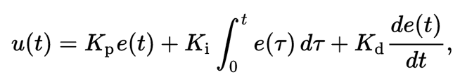
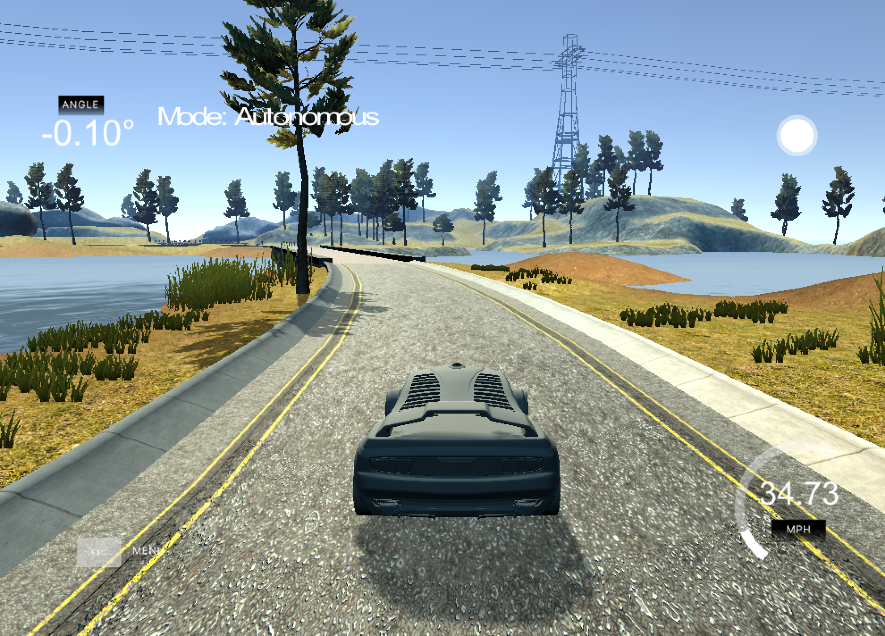

# PID Controller Project
Self-Driving Car Engineer Nanodegree Program

## Project Description
The purpose of this project is to build a PID controller. The simulator provides cross-track error (CTE), speed, and steering angle data via local websocket. The PID (proportional/integral/differential) controller must respond with steering and throttle commands to drive the car reliably around the simulator track.

---

## Dependencies

* cmake >= 3.5
 * All OSes: [click here for installation instructions](https://cmake.org/install/)
* make >= 4.1(mac, linux), 3.81(Windows)
  * Linux: make is installed by default on most Linux distros
  * Mac: [install Xcode command line tools to get make](https://developer.apple.com/xcode/features/)
  * Windows: [Click here for installation instructions](http://gnuwin32.sourceforge.net/packages/make.htm)
* gcc/g++ >= 5.4
  * Linux: gcc / g++ is installed by default on most Linux distros
  * Mac: same deal as make - [install Xcode command line tools]((https://developer.apple.com/xcode/features/)
  * Windows: recommend using [MinGW](http://www.mingw.org/)
* [uWebSockets](https://github.com/uWebSockets/uWebSockets)
  * Run either `./install-mac.sh` or `./install-ubuntu.sh`.
  * If you install from source, checkout to commit `e94b6e1`, i.e.
    ```
    git clone https://github.com/uWebSockets/uWebSockets 
    cd uWebSockets
    git checkout e94b6e1
    ```
    Some function signatures have changed in v0.14.x. See [this PR](https://github.com/udacity/CarND-MPC-Project/pull/3) for more details.
* Simulator. You can download these from the [project intro page](https://github.com/udacity/self-driving-car-sim/releases) in the classroom.

## Basic Build Instructions

1. Clone this repo.
2. Make a build directory: `mkdir build && cd build`
3. Compile: `cmake .. && make`
4. Run it: `./pid`. 

Tips for setting up your environment can be found [here](https://classroom.udacity.com/nanodegrees/nd013/parts/40f38239-66b6-46ec-ae68-03afd8a601c8/modules/0949fca6-b379-42af-a919-ee50aa304e6a/lessons/f758c44c-5e40-4e01-93b5-1a82aa4e044f/concepts/23d376c7-0195-4276-bdf0-e02f1f3c665d)

---

## Reflection

### PID
PID control is a technique to redule the trajectory error by using P, I and D on cross tracking error (CTE) and defined as this:


The P, or "proportional", component had the most directly observable effect on the car's behavior. It causes the car to steer proportional (and opposite) to the car's distance from the lane center (which is the CTE) - if the car is far to the right it steers hard to the left, if it's slightly to the left it steers slightly to the right.

The D, or "derivative", component counteracts the P component's tendency to ring and overshoot the center line. A properly tuned D parameter will cause the car to approach the center line smoothly without ringing.

The I, or "integral", component counteracts a bias in the CTE which prevents the P-D controller from reaching the center line. This bias can take several forms, such as a steering drift (as in the Control unit lessons), but I believe that in this particular implementation the I component particularly serves to reduce the CTE around curves.

### Parameter Tuning
Hyperparameter, Kp, Ki and Kd can be tuned in different ways such as trial-and-error, SGD. Here, I used Twiddle from the lecture. 
First, I tried manual tuning to find the initial values and then run twiddle to finetune the parameter using the first 600 data points.
The resulting parameter was, Kp=0.15, Ki=0.001, Kd=1.7.

### Simulation
Finally, run the simulator to confirm the vehicle can drive a round without going off track.
